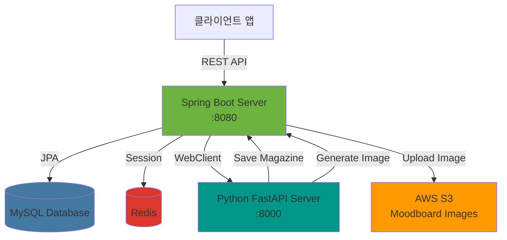
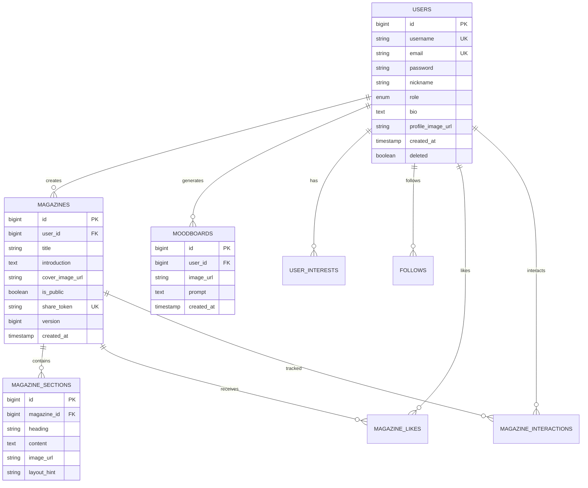

# M:ine - AI 기반 개인화 매거진 플랫폼 🎨

> AI가 생성하는 나만의 매거진, 취향을 담은 무드보드까지

[](https://spring.io/projects/spring-boot)
[](https://www.oracle.com/java/)
[](https://www.mysql.com/)
[](https://redis.io/)
[](https://aws.amazon.com/s3/)

## 👥 Contributors

<table align="center">
  <tr>
    <td align="center" width="150px">
      <a href="https://github.com/jangjimin9766">
        
      </a>
    </td>
  </tr>
  <tr>
    <td align="center">
      <b>Jimin Jang</b><br/>
      <a href="https://github.com/jangjimin9766">@jangjimin9766</a><br/>
      <br/>
      Team Leader<br/>
      Back-end Dev
    </td>
  </tr>
</table>

## 📋 목차

- [프로젝트 소개](#-프로젝트-소개)
- [주요 기능](#-주요-기능)
- [기술 스택](#-기술-스택)
- [시스템 아키텍처](#-시스템-아키텍처)
- [시작하기](#-시작하기)
- [API 문서](#-api-문서)
- [데이터베이스 스키마](#-데이터베이스-스키마)
- [보안](#-보안)
- [테스트](#-테스트)
- [배포](#-배포)

## 🌟 프로젝트 소개

**M:ine**은 사용자의 취향을 분석하여 AI가 자동으로 매거진 콘텐츠를 생성하고, Stable Diffusion을 활용한 무드보드(배경화면)를 제공하는 혁신적인 플랫폼입니다.

### 핵심 가치

- 🤖 **AI 기반 콘텐츠 생성**: Python FastAPI 서버와 연동하여 사용자 취향에 맞는 매거진 자동 생성
- 🎨 **무드보드 생성**: Stable Diffusion SDXL을 활용한 고품질 배경화면 생성
- 📱 **개인화 피드**: 사용자의 관심사와 상호작용을 기반으로 한 맞춤형 콘텐츠 추천
- 🔐 **강력한 보안**: JWT 기반 인증 및 Refresh Token을 통한 안전한 세션 관리
- 🚀 **확장 가능한 아키텍처**: Spring Boot + Python FastAPI 마이크로서비스 구조

## ✨ 주요 기능

### 1. 사용자 관리 (`/api/auth`, `/api/users`)
- ✅ 회원가입 및 로그인 (JWT 토큰 기반)
- ✅ Access Token / Refresh Token 관리
- ✅ 프로필 수정 및 비밀번호 변경
- ✅ 회원 탈퇴 (Soft Delete)
- ✅ 관심사 설정 (최대 3개 선택)

### 2. 매거진 기능 (`/api/magazines`)
- ✅ **AI 자동 생성**: Python AI 서버를 통한 매거진 콘텐츠 생성
- ✅ **CRUD 작업**: 매거진 생성, 조회, 수정, 삭제
- ✅ **공개/비공개 설정**: 공개 시 고유한 공유 토큰 자동 생성
- ✅ **공유 링크**: 인증 없이 공유 토큰으로 매거진 조회 가능
- ✅ **좋아요 기능**: 매거진 좋아요 및 좋아요한 매거진 목록 조회
- ✅ **검색 및 필터링**: 키워드 기반 전체 텍스트 검색
- ✅ **페이지네이션**: 효율적인 데이터 로딩

### 3. 무드보드 생성 (`/api/moodboards`)
- ✅ **AI 배경화면 생성**: 사용자 취향 기반 Stable Diffusion 이미지 생성
- ✅ **S3 저장**: AWS S3에 안전하게 이미지 저장
- ✅ **Re-roll 기능**: 마음에 들지 않으면 새로운 이미지 생성 가능

### 4. 소셜 기능 (`/api/users`)
- ✅ 팔로우/언팔로우
- ✅ 팔로워/팔로잉 목록 조회
- ✅ 다른 사용자 프로필 조회

### 5. 상호작용 추적 (`/api/magazines/{id}/interactions`)
- ✅ 매거진 조회 기록 (View)
- ✅ 섹션 스크롤 깊이 추적
- ✅ 개인화 피드 알고리즘을 위한 데이터 수집

## 🛠 기술 스택

### Backend (Spring Boot)
```yaml
Framework: Spring Boot 3.2.0
Language: Java 17
Build Tool: Gradle
```

### 핵심 라이브러리
- **Spring Data JPA**: ORM 및 데이터베이스 연동
- **Spring Security**: 인증 및 권한 관리
- **Spring Data Redis**: 세션 관리 및 캐싱
- **Spring WebFlux**: Python AI 서버와 비동기 통신
- **JWT (jjwt)**: 토큰 기반 인증
- **Lombok**: 보일러플레이트 코드 제거
- **SpringDoc OpenAPI**: Swagger UI 자동 생성

### 데이터베이스
- **MySQL 8.0**: 메인 데이터베이스
- **Redis**: Refresh Token 저장 및 블랙리스트 관리

### 클라우드 인프라
- **AWS S3**: 무드보드 이미지 저장
- **Region**: `ap-southeast-2` (시드니)

### 외부 서비스
- **Python FastAPI Server**: AI 기반 매거진 생성 및 무드보드 생성
  - Endpoint: `http://localhost:8000`
  - Stable Diffusion SDXL (로컬 실행, M4/MPS 가속)

## 🏗 시스템 아키텍처



### 데이터 흐름

#### 1. 매거진 생성 플로우
```
사용자 → Spring Server → Python AI Server
                ↓
        MySQL에 매거진 저장
                ↓
         사용자에게 응답
```

#### 2. 무드보드 생성 플로우
```
사용자 → Spring Server → Python Server (Stable Diffusion)
                ↓
          Base64 이미지 수신
                ↓
          AWS S3에 업로드
                ↓
        MySQL에 URL 저장
                ↓
         사용자에게 응답
```

## 🚀 시작하기

### 사전 요구사항

```bash
# Required
- Java 17 이상
- MySQL 8.0
- Redis
- Gradle 8.x
- AWS 계정 (S3 사용)

# Optional
- Python FastAPI Server (AI 기능 사용 시)
```

### 1. 저장소 클론

```bash
git clone https://github.com/Jangjimin9766/Mine_server.git
cd Mine_server
```

### 2. 데이터베이스 설정

```sql
-- MySQL 데이터베이스 생성
CREATE DATABASE mine_db CHARACTER SET utf8mb4 COLLATE utf8mb4_unicode_ci;
```

### 3. 환경 변수 설정

`src/main/resources/application-secret.yml` 파일 생성:

```yaml
spring:
  datasource:
    password: "your-mysql-password"
  cloud:
    aws:
      credentials:
        access-key: "your-aws-access-key"
        secret-key: "your-aws-secret-key"

python:
  api:
    key: "your-python-api-key"
```

### 4. Redis 실행

```bash
# macOS
brew install redis
brew services start redis

# Linux
sudo systemctl start redis

# Docker
docker run -d -p 6379:6379 redis
```

### 5. 애플리케이션 실행

```bash
# Gradle 빌드 및 실행
./gradlew build
./gradlew bootRun

# 또는 JAR 파일 직접 실행
java -jar build/libs/api-0.0.1-SNAPSHOT.jar
```

서버가 성공적으로 시작되면 `http://localhost:8080`에서 접근 가능합니다.

### 6. Swagger UI 확인

브라우저에서 다음 URL로 이동:
```
http://localhost:8080/swagger-ui.html
```

## 📚 API 문서

### 인증 API

| Method | Endpoint | Description | Auth Required |
|--------|----------|-------------|---------------|
| POST | `/api/auth/signup` | 회원가입 | ❌ |
| POST | `/api/auth/login` | 로그인 | ❌ |
| POST | `/api/auth/refresh` | 토큰 갱신 | ❌ |
| POST | `/api/auth/logout` | 로그아웃 | ✅ |
| PATCH | `/api/auth/password` | 비밀번호 변경 | ✅ |

### 매거진 API

| Method | Endpoint | Description | Auth Required |
|--------|----------|-------------|---------------|
| POST | `/api/magazines/generate` | AI 매거진 생성 | ✅ |
| GET | `/api/magazines/my` | 내 매거진 목록 | ✅ |
| GET | `/api/magazines/{id}` | 매거진 상세 조회 | ✅ |
| PUT | `/api/magazines/{id}` | 매거진 수정 | ✅ |
| DELETE | `/api/magazines/{id}` | 매거진 삭제 | ✅ |
| POST | `/api/magazines/{id}/visibility` | 공개/비공개 설정 | ✅ |
| GET | `/api/magazines/share/{shareToken}` | 공유 링크로 조회 | ❌ |
| GET | `/api/magazines/search` | 키워드 검색 | ❌ |
| POST | `/api/magazines/{id}/like` | 좋아요 토글 | ✅ |
| GET | `/api/magazines/liked` | 좋아요한 매거진 목록 | ✅ |

### 무드보드 API

| Method | Endpoint | Description | Auth Required |
|--------|----------|-------------|---------------|
| POST | `/api/moodboards` | 무드보드 생성 | ✅ |

### 사용자 API

| Method | Endpoint | Description | Auth Required |
|--------|----------|-------------|---------------|
| GET | `/api/users/profile` | 내 프로필 조회 | ✅ |
| PUT | `/api/users/profile` | 프로필 수정 | ✅ |
| DELETE | `/api/users` | 회원 탈퇴 | ✅ |
| POST | `/api/users/{id}/follow` | 팔로우 | ✅ |
| DELETE | `/api/users/{id}/unfollow` | 언팔로우 | ✅ |
| GET | `/api/users/{id}/followers` | 팔로워 목록 | ✅ |
| GET | `/api/users/{id}/following` | 팔로잉 목록 | ✅ |

### 관심사 API

| Method | Endpoint | Description | Auth Required |
|--------|----------|-------------|---------------|
| GET | `/api/interests` | 전체 관심사 목록 | ❌ |
| GET | `/api/interests/my` | 내 관심사 조회 | ✅ |
| PUT | `/api/interests` | 관심사 설정 (최대 3개) | ✅ |

### 내부 API (Python 서버 전용)

| Method | Endpoint | Description | Auth Required |
|--------|----------|-------------|---------------|
| POST | `/api/internal/magazine` | 매거진 저장 | ❌ |

## 💾 데이터베이스 스키마

### 핵심 테이블

#### Users (사용자)
```sql
users
├── id (PK)
├── username (UNIQUE)
├── email (UNIQUE)
├── password (BCrypt)
├── nickname
├── role (ENUM: USER, ADMIN)
├── bio
├── profile_image_url
├── created_at
├── updated_at
├── deleted (Soft Delete)
└── deleted_at
```

#### Magazines (매거진)
```sql
magazines
├── id (PK)
├── user_id (FK → users)
├── title
├── introduction (TEXT)
├── cover_image_url
├── is_public (BOOLEAN)
├── share_token (UNIQUE, 12자)
├── version (낙관적 락)
└── created_at
```

#### Magazine Sections (매거진 섹션)
```sql
magazine_sections
├── id (PK)
├── magazine_id (FK → magazines)
├── heading
├── content (TEXT)
├── image_url
└── layout_hint
```

#### Moodboards (무드보드)
```sql
moodboards
├── id (PK)
├── user_id (FK → users)
├── image_url (S3 URL)
├── prompt (TEXT)
└── created_at
```

#### Magazine Interactions (상호작용 추적)
```sql
magazine_interactions
├── id (PK)
├── magazine_id (FK → magazines)
├── user_id (FK → users)
├── interaction_type (ENUM: VIEW)
├── scroll_depth (0-100)
└── created_at
```

### ERD



## 🔐 보안

### 인증 및 권한

- **JWT 토큰 기반 인증**
  - Access Token: 만료 시간 짧음 (1시간)
  - Refresh Token: 만료 시간 김 (7일), Redis에 저장
  - 블랙리스트: 로그아웃된 토큰 관리

### 보안 기능

- ✅ BCrypt 비밀번호 암호화
- ✅ CORS 설정으로 허용된 도메인만 접근 가능
- ✅ CSRF 보호 (Stateless 아키텍처)
- ✅ SQL Injection 방지 (JPA/Hibernate)
- ✅ 공유 토큰: SecureRandom + Base64 URL-safe 인코딩

### 권한 레벨

| Role | Description |
|------|-------------|
| USER | 일반 사용자 |
| ADMIN | 관리자 |

## 🧪 테스트

### 테스트 실행

```bash
# 전체 테스트
./gradlew test

# 특정 테스트만 실행
./gradlew test --tests "com.mine.api.controller.MagazineControllerTest"

# 테스트 결과 확인
open build/reports/tests/test/index.html
```

### 테스트 커버리지

- ✅ Controller Layer Tests (7개)
  - AuthControllerTest
  - MagazineControllerTest
  - MoodboardControllerTest
  - UserControllerTest
  - InterestControllerTest
  - MagazineInteractionControllerTest
  - InternalApiControllerTest

- ✅ Service Layer Tests (4개)
  - AuthServiceTest
  - MagazineServiceTest
  - MoodboardServiceTest
  - S3ConnectionTest

## 📦 배포

### 프로덕션 빌드

```bash
# JAR 파일 생성
./gradlew clean build -x test

# 생성된 파일 확인
ls -lh build/libs/
```

### 환경별 설정

```bash
# 개발 환경 (기본)
./gradlew bootRun

# 프로덕션 환경
java -jar -Dspring.profiles.active=prod build/libs/api-0.0.1-SNAPSHOT.jar
```

### Docker 배포 (예정)

```dockerfile
# Dockerfile (참고용)
FROM openjdk:17-jdk-slim
WORKDIR /app
COPY build/libs/api-0.0.1-SNAPSHOT.jar app.jar
EXPOSE 8080
ENTRYPOINT ["java", "-jar", "app.jar"]
```

## 🔧 설정 파일

### application.yml

```yaml
spring:
  datasource:
    url: jdbc:mysql://localhost:3306/mine_db?useSSL=false&allowPublicKeyRetrieval=true&serverTimezone=UTC
    driver-class-name: com.mysql.cj.jdbc.Driver
  jpa:
    hibernate:
      ddl-auto: update
    properties:
      hibernate:
        dialect: org.hibernate.dialect.MySQLDialect
        show_sql: true
        format_sql: true
  data:
    redis:
      host: localhost
      port: 6379
  cloud:
    aws:
      s3:
        bucket: mine-moodboard-bucket
      region:
        static: ap-southeast-2

python:
  api:
    url: http://localhost:8000/api/magazine/create
    moodboard-url: http://localhost:8000/api/magazine/moodboard
```

## 🤝 Python AI 서버 연동

Python FastAPI 서버와의 통합 가이드는 [FASTAPI_GUIDE.md](FASTAPI_GUIDE.md)를 참조하세요.

### 주요 통합 포인트

1. **매거진 생성**: Spring → Python (AI 생성) → Spring (저장)
2. **무드보드 생성**: Spring → Python (Stable Diffusion) → AWS S3 → Spring (URL 저장)

## 📈 성능 최적화

### 데이터베이스 최적화

- ✅ **N+1 쿼리 방지**: `@EntityGraph` 및 Fetch Join 사용
- ✅ **Lazy Loading**: 필요한 경우에만 연관 엔티티 로드
- ✅ **@Formula**: Hibernate 가상 컬럼으로 집계 쿼리 최적화
  - `followerCount`, `followingCount`, `magazineCount`

### 캐싱 전략

- ✅ Redis를 활용한 Refresh Token 저장
- ✅ 블랙리스트 토큰 캐싱

### 페이지네이션

- ✅ `Pageable` 인터페이스 활용
- ✅ 기본 정렬: 최신순 (`createdAt DESC`)

## 🐛 트러블슈팅

### 일반적인 문제

#### 1. MySQL 연결 실패
```bash
# MySQL이 실행 중인지 확인
brew services list | grep mysql

# MySQL 재시작
brew services restart mysql
```

#### 2. Redis 연결 실패
```bash
# Redis 상태 확인
redis-cli ping
# 응답: PONG

# Redis 재시작
brew services restart redis
```

#### 3. S3 업로드 실패
- AWS 자격 증명 확인
- S3 버킷 권한 확인 (PutObject 권한 필요)
- 리전 설정이 올바른지 확인

#### 4. Python 서버 연결 실패
- Python FastAPI 서버가 `http://localhost:8000`에서 실행 중인지 확인
- CORS 설정 확인

## 📝 개발 로드맵

### Phase 1 ✅ (완료)
- [x] 사용자 인증 시스템
- [x] 매거진 CRUD
- [x] 매거진 삭제 및 수정

### Phase 2 ✅ (완료)
- [x] 공개/비공개 설정
- [x] 공유 링크 생성
- [x] 검색 기능

### Phase 3 ✅ (완료)
- [x] 좋아요 기능
- [x] 무드보드 생성

### Phase 4 ✅ (완료)
- [x] 개인화 피드 알고리즘
- [x] 상호작용 추적

### Phase 5-7 ✅ (완료)
- [x] 프로필 수정
- [x] 회원 탈퇴 (Soft Delete)
- [x] 비밀번호 변경
- [x] 팔로우/언팔로우 시스템

### 향후 계획 🚧
- [ ] 관리자 대시보드
- [ ] 알림 시스템
- [ ] 이메일 인증
- [ ] OAuth 소셜 로그인 (Google, Kakao)
- [ ] WebSocket 실시간 알림
- [ ] 매거진 추천 시스템 고도화
- [ ] CI/CD 파이프라인 구축
- [ ] Kubernetes 배포

## 📄 라이선스

이 프로젝트는 개인 프로젝트입니다.

## 📞 문의

프로젝트에 대한 질문이나 제안사항이 있으시면 이슈를 생성해주세요.

---

**Made by M:ine Team**
