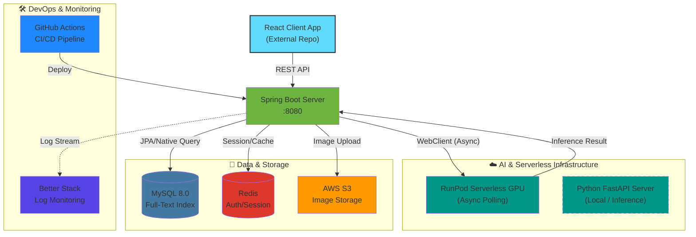
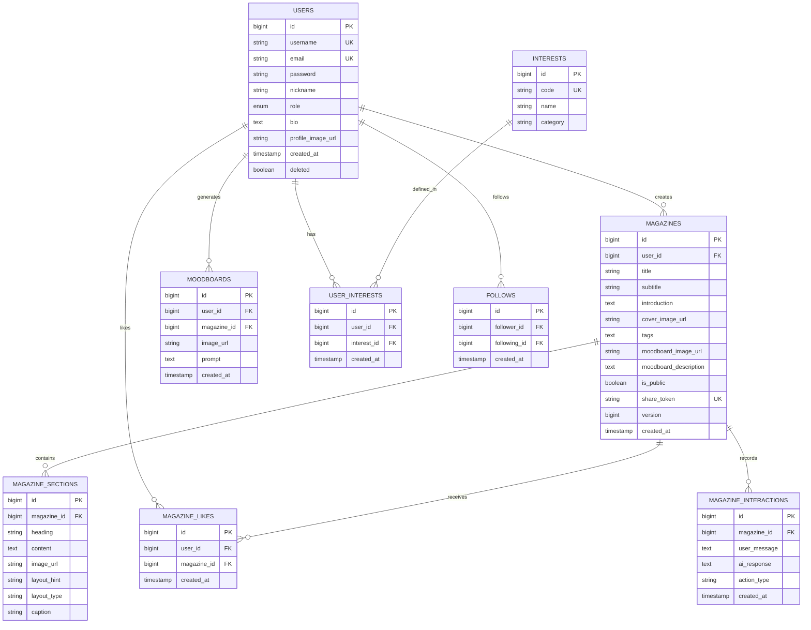

# M:ine - AI 기반 개인화 매거진 플랫폼 (Backend Server) 🎨

[](https://github.com/Jangjimin9766/Mine-AI)
[](https://github.com/drddyn/Mine-FE)

> **Backend API Server Repository**
> AI가 생성하는 나만의 매거진, 취향을 담은 무드보드까지

[](https://spring.io/projects/spring-boot)
[](https://www.oracle.com/java/)
[](https://www.mysql.com/)
[](https://redis.io/)
[](https://aws.amazon.com/s3/)

## 📋 목차

- [프로젝트 소개](#-프로젝트-소개)
- [주요 기능](#-주요-기능)
- [기술 스택](#-기술-스택)
- [시스템 아키텍처](#-시스템-아키텍처)
- [시작하기](#-시작하기)
- [API 문서](#-api-문서)
- [데이터베이스 스키마](#-데이터베이스-스키마)
- [보안](#-보안)
- [테스트](#-테스트)
- [배포](#-배포)

## 🌟 프로젝트 소개

**M:ine Server**는 AI 기반 매거진 플랫폼의 **백엔드 API 서버**입니다.
사용자의 취향을 분석하여 AI가 자동으로 매거진 콘텐츠를 생성하고, 무드보드를 제공합니다.

> 이 저장소는 오직 **API 서버와 데이터 처리**를 담당합니다.

### 핵심 가치

- 🤖 **AI 기반 콘텐츠 생성**: Python FastAPI 서버와 연동하여 사용자 취향에 맞는 매거진 자동 생성
- 🎨 **무드보드 생성**: Stable Diffusion SDXL을 활용한 고품질 배경화면 생성
- 📱 **RESTful API**: React 클라이언트를 위한 완벽한 API 명세 제공
- 🔐 **강력한 보안**: JWT 기반 인증 및 Refresh Token을 통한 안전한 세션 관리
- 🚀 **확장 가능한 아키텍처**: Spring Boot + Python FastAPI 마이크로서비스 구조

## 🚀 Engineering Highlights (Technical Achievements)

> **"안정성과 확장성을 고려한 고성능 백엔드 아키텍처 설계"**

본 프로젝트는 대규모 데이터 처리와 외부 AI 서비스 연동 시 발생할 수 있는 기술적 난제들을 해결하기 위해 다음과 같은 엔지니어링 전략을 도입했습니다.

### 1. Performance Optimization
- **Full-Text Search Optimization**: 기존 `LIKE` 쿼리의 성능 한계(3.2s)를 극복하기 위해 **MySQL Full-Text Index (N-gram Parser)** 및 Native Query를 도입하여 검색 성능을 **0.017s (약 180배)**로 획기적으로 개선했습니다.
- **Efficient Pagination**: 데이터 증가에 따른 성능 저하를 방지하기 위해 **No-Offset (Cursor-based)** 페이징을 적용하여 일관된 조회 성능을 보장했습니다.
- **Query Optimization**: `Fetch Join`과 `@EntityGraph`를 적재적소에 활용하여 N+1 문제를 해결하고, JPA `@Formula`를 통해 통계 데이터를 효율적으로 조회했습니다.

### 2. Resilience & Stability
- **Circuit Breaker Pattern**: 외부 AI 서비스(RunPod)의 장애가 전체 시스템으로 전파되는 것을 차단하기 위해 **Resilience4j**를 도입했습니다. 50% 이상의 실패율 감지 시 즉시 Fallback 처리하여 시스템 생존성을 확보했습니다.
- **Safe Timeout Strategy**: AI 모델의 긴 생성 시간(Long-running Task)을 고려하여 정교한 TimeLimiter 전략을 수립, 불필요한 타임아웃 오류를 방지했습니다.

### 3. Asynchronous Architecture
- **Event-Driven AI Processing**: **Serverless GPU (RunPod)**와 **Spring WebClient**를 활용한 비동기 폴링(Async Polling) 구조를 설계하여, 고비용 GPU 리소스를 효율적으로 사용하고 비용을 **90% 이상 절감**했습니다.

### 4. Security & DevOps
- **Enhanced Security**: Stateless한 JWT 인증 방식의 한계를 보완하기 위해 **Redis 기반 Blacklist** 전략을 구현하여 안전한 로그아웃 처리를 지원합니다.
- **Reliable CI/CD**: **GitHub Actions**를 통해 빌드부터 테스트, 배포까지 전 과정을 자동화하고, **PowerShell E2E Script**로 주요 비즈니스 시나리오를 사전에 검증하여 배포 안정성을 높였습니다.
- **Observability**: **Better Stack (Logtail)**을 연동하여 분산 환경에서의 실시간 로그 모니터링 체계를 구축했습니다.

## ✨ 주요 기능

### 1. 사용자 관리 (`/api/auth`, `/api/users`)
- ✅ 회원가입 및 로그인 (JWT 토큰 기반)
- ✅ Access Token / Refresh Token 관리
- ✅ 프로필 수정 및 비밀번호 변경
- ✅ 회원 탈퇴 (Soft Delete)
- ✅ 관심사 설정 (최대 3개 선택)

### 2. 매거진 기능 (`/api/magazines`)
- ✅ **AI 자동 생성**: Python AI 서버를 통한 매거진 콘텐츠 생성
- ✅ **CRUD 작업**: 매거진 생성, 조회, 수정, 삭제
- ✅ **커버 이미지 변경**: 매거진 커버 이미지 개별 수정
- ✅ **공개/비공개 설정**: 공개 시 고유한 공유 토큰 자동 생성
- ✅ **공유 링크**: 인증 없이 공유 토큰으로 매거진 조회 가능
- ✅ **좋아요 기능**: 매거진 좋아요 및 좋아요한 매거진 목록 조회
- ✅ **검색 및 필터링**: 키워드 기반 전체 텍스트 검색 (본인 비공개 매거진 포함)
- ✅ **페이지네이션**: 효율적인 데이터 로딩
- ✅ **AI 상호작용**: 매거진 전체에 대한 AI 대화형 편집

### 3. 섹션 편집 (`/api/magazines/{id}/sections`) ⭐ NEW
- ✅ **섹션 CRUD**: 개별 섹션(카드) 조회, 수정, 삭제
- ✅ **순서 변경**: 드래그 앤 드롭 방식 섹션 재정렬
- ✅ **AI 상호작용**: 개별 섹션에 대한 AI 대화형 편집 (톤 변경, 내용 추가 등)

### 4. 무드보드 생성 (`/api/moodboards`, `/api/magazines/{id}/moodboards`)
- ✅ **매거진 기반 무드보드**: 매거진 제목/태그로 자동 생성 (magazineId만 필요)
- ✅ **AI 배경화면 생성**: Stable Diffusion 이미지 생성
- ✅ **S3 저장**: AWS S3에 안전하게 이미지 저장
- ✅ **배경 자동 업데이트**: 무드보드 재생성 시 매거진 배경 자동 변경
- ✅ **히스토리 보관**: 이전 무드보드 기록 유지

### 5. 소셜 기능 (`/api/users`)
- ✅ 팔로우/언팔로우
- ✅ 팔로워/팔로잉 목록 조회
- ✅ 다른 사용자 프로필 조회

### 6. AI 상호작용 (`/api/magazines/{id}/interactions`)
- ✅ **대화형 편집**: AI와 대화를 통해 매거진 내용 수정
- ✅ **섹션 재생성**: 특정 섹션의 스타일이나 내용을 AI에게 요청하여 변경
- ✅ **히스토리 관리**: AI와의 편집 대화 기록 저장

## 🛠 기술 스택

### Backend (Spring Boot)
```yaml
Framework: Spring Boot 3.2.0
Language: Java 17
Build Tool: Gradle
```

### 핵심 라이브러리
- **Spring Data JPA**: ORM 및 데이터베이스 연동
- **Spring Security**: 인증 및 권한 관리
- **Spring Data Redis**: 세션 관리 및 캐싱
- **Spring WebFlux**: Python AI 서버와 비동기 통신
- **JWT (jjwt)**: 토큰 기반 인증
- **Lombok**: 보일러플레이트 코드 제거
- **SpringDoc OpenAPI**: Swagger UI 자동 생성

### 데이터베이스
- **MySQL 8.0**: 메인 데이터베이스
- **Redis**: Refresh Token 저장 및 블랙리스트 관리

### 클라우드 인프라
- **AWS S3**: 무드보드 이미지 저장
- **Region**: `ap-southeast-2` (시드니)
- **GitHub Actions**: CI/CD 자동 배포 파이프라인

### 외부 서비스
- **Python FastAPI Server**: AI 기반 매거진 생성 및 무드보드 생성
  - Local: `http://localhost:8000` (동기 호출)
  - Production: **RunPod Serverless** (비동기 폴링)
  - Stable Diffusion SDXL (로컬: M4/MPS 가속, 프로덕션: GPU 서버리스)

## 🏗 시스템 아키텍처


```mermaid
graph TB
    Client["React Client App<br/>(External Repo)"]
    SpringServer[Spring Boot Server<br/>:8080]
    
    subgraph AI_Infrastructure ["☁️ AI & Serverless Infrastructure"]
        RunPod["RunPod Serverless GPU<br/>(Async Polling)"]
        PythonServer["Python FastAPI Server<br/>(Local / Inference)"]
    end
    
    subgraph Data_Storage ["💾 Data & Storage"]
        MySQL[("MySQL 8.0<br/>Full-Text Index")]
        Redis[("Redis<br/>Auth/Session")]
        S3["AWS S3<br/>Image Storage"]
    end
    
    subgraph Operations ["🛠 DevOps & Monitoring"]
        Actions["GitHub Actions<br/>CI/CD Pipeline"]
        BetterStack["Better Stack<br/>Log Monitoring"]
    end
    
    %% Flows
    Client -->|REST API| SpringServer
    
    SpringServer -->|JPA/Native Query| MySQL
    SpringServer -->|Session/Cache| Redis
    SpringServer -->|Image Upload| S3
    
    %% AI Integration
    SpringServer -->|"WebClient (Async)"| RunPod
    RunPod -->|Inference Result| SpringServer
    
    %% DevOps
    Actions -->|Deploy| SpringServer
    SpringServer -.->|Log Stream| BetterStack
    
    %% System Styles
    style Client fill:#61DAFB,stroke:#333,stroke-width:2px
    style SpringServer fill:#6db33f
    style RunPod fill:#009688
    style PythonServer fill:#009688,stroke-dasharray: 5 5
    style MySQL fill:#4479a1
    style Redis fill:#dc382d
    style S3 fill:#ff9900
    style Actions fill:#2088FF
    style BetterStack fill:#5744e6
```

### 데이터 흐름

#### 1. 매거진 생성 플로우
```
사용자 → Spring Server → Python AI Server
                ↓
        MySQL에 매거진 저장
                ↓
         사용자에게 응답
```

#### 2. 무드보드 생성 플로우
```
사용자 → Spring Server → Python Server (Stable Diffusion)
                ↓
          Base64 이미지 수신
                ↓
          AWS S3에 업로드
                ↓
        MySQL에 URL 저장
                ↓
         사용자에게 응답
```

## 🚀 시작하기

### 사전 요구사항

```bash
# Required
- Java 17 이상
- MySQL 8.0
- Redis
- Gradle 8.x
- AWS 계정 (S3 사용)

# Optional
- Python FastAPI Server (AI 기능 사용 시)
```

### 1. 저장소 클론

```bash
git clone https://github.com/Jangjimin9766/Mine_server.git
cd Mine_server
```

### 2. 데이터베이스 설정

```sql
-- MySQL 데이터베이스 생성
CREATE DATABASE mine_db CHARACTER SET utf8mb4 COLLATE utf8mb4_unicode_ci;
```

### 3. 환경 변수 설정

`src/main/resources/application-secret.yml` 파일 생성:

```yaml
spring:
  datasource:
    password: "your-mysql-password"
  cloud:
    aws:
      credentials:
        access-key: "your-aws-access-key"
        secret-key: "your-aws-secret-key"

python:
  api:
    key: "your-python-api-key"
```

### 4. Redis 실행

```bash
# macOS
brew install redis
brew services start redis

# Linux
sudo systemctl start redis

# Docker
docker run -d -p 6379:6379 redis
```

### 5. 애플리케이션 실행

**서버 실행 전, 반드시 MySQL과 Redis가 실행 중이어야 합니다.**

```bash
# Gradle 빌드 및 실행
./gradlew build
./gradlew bootRun

# 또는 JAR 파일 직접 실행
java -jar build/libs/api-0.0.1-SNAPSHOT.jar
```

서버가 성공적으로 시작되면 다음 주소에서 API에 접근 가능합니다.
- Base URL: `http://localhost:8080`
- API Docs: `http://localhost:8080/swagger-ui.html`

### 6. Swagger UI 확인

브라우저에서 다음 URL로 이동:
```
http://localhost:8080/swagger-ui.html
```

## 📚 API 문서

### 인증 API

| Method | Endpoint | Description | Auth Required |
|--------|----------|-------------|---------------|
| POST | `/api/auth/signup` | 회원가입 | ❌ |
| POST | `/api/auth/login` | 로그인 | ❌ |
| POST | `/api/auth/refresh` | 토큰 갱신 | ❌ |
| POST | `/api/auth/logout` | 로그아웃 | ✅ |
| PATCH | `/api/auth/password` | 비밀번호 변경 | ✅ |

### 매거진 API

| Method | Endpoint | Description | Auth Required |
|--------|----------|-------------|---------------|
| POST | `/api/magazines` | AI 매거진 생성 | ✅ |
| GET | `/api/magazines` | 내 매거진 목록 | ✅ |
| GET | `/api/magazines/{id}` | 매거진 상세 조회 | ✅ |
| PATCH | `/api/magazines/{id}` | 제목/소개 수정 | ✅ |
| DELETE | `/api/magazines/{id}` | 매거진 삭제 | ✅ |
| PATCH | `/api/magazines/{id}/visibility` | 공개/비공개 설정 | ✅ |
| PATCH | `/api/magazines/{id}/cover` | 커버 이미지 변경 | ✅ |
| GET | `/api/magazines/share/{shareToken}` | 공유 링크로 조회 | ❌ |
| GET | `/api/magazines/search` | 키워드 검색 | ❌ |
| POST | `/api/magazines/{id}/likes` | 좋아요 토글 | ✅ |
| GET | `/api/magazines/liked` | 좋아요한 매거진 목록 | ✅ |
| GET | `/api/magazines/feed` | 개인화 피드 | ✅ |
| POST | `/api/magazines/{id}/interact` | AI 상호작용 (매거진 레벨) | ✅ |

### 섹션 API ⭐ NEW

| Method | Endpoint | Description | Auth Required |
|--------|----------|-------------|---------------|
| GET | `/api/magazines/{id}/sections/{sectionId}` | 섹션 상세 조회 | ✅ |
| PATCH | `/api/magazines/{id}/sections/{sectionId}` | 섹션 직접 수정 | ✅ |
| DELETE | `/api/magazines/{id}/sections/{sectionId}` | 섹션 삭제 | ✅ |
| PATCH | `/api/magazines/{id}/sections/reorder` | 섹션 순서 변경 | ✅ |
| POST | `/api/magazines/{id}/sections/{sectionId}/interact` | AI 상호작용 (섹션 레벨) | ✅ |
| GET | `/api/sections/recent` | 최근 열람한 섹션 히스토리 (Recent Views) | ✅ |

### 이미지 API ⭐ NEW

| Method | Endpoint | Description | Auth Required |
|--------|----------|-------------|---------------|
| POST | `/api/images` | 이미지 업로드 (S3) | ✅ |

### 무드보드 API

| Method | Endpoint | Description | Auth Required |
|--------|----------|-------------|---------------|
| POST | `/api/moodboards` | 무드보드 생성 (standalone) | ✅ |
| POST | `/api/magazines/{id}/moodboards` | 매거진 기반 무드보드 생성 ⭐ NEW | ✅ |

### 사용자 API

| Method | Endpoint | Description | Auth Required |
|--------|----------|-------------|---------------|
| GET | `/api/users/profile` | 내 프로필 조회 | ✅ |
| PUT | `/api/users/profile` | 프로필 수정 | ✅ |
| DELETE | `/api/users` | 회원 탈퇴 | ✅ |
| POST | `/api/users/{id}/follow` | 팔로우 | ✅ |
| DELETE | `/api/users/{id}/unfollow` | 언팔로우 | ✅ |
| GET | `/api/users/{id}/followers` | 팔로워 목록 | ✅ |
| GET | `/api/users/{id}/following` | 팔로잉 목록 | ✅ |

### 관심사 API

| Method | Endpoint | Description | Auth Required |
|--------|----------|-------------|---------------|
| GET | `/api/interests` | 전체 관심사 목록 | ❌ |
| GET | `/api/interests/my` | 내 관심사 조회 | ✅ |
| PUT | `/api/interests` | 관심사 설정 (최대 3개) | ✅ |

### 내부 API (Python 서버 전용)

| Method | Endpoint | Description | Auth Required |
|--------|----------|-------------|---------------|
| POST | `/api/internal/magazine` | 매거진 저장 | ❌ |

## 💾 데이터베이스 스키마

### 핵심 테이블

#### Users (사용자)
```sql
users
├── id (PK)
├── username (UNIQUE)
├── email (UNIQUE)
├── password (BCrypt)
├── nickname
├── role (ENUM: USER, ADMIN)
├── bio
├── profile_image_url
├── created_at
├── updated_at
├── deleted (Soft Delete)
└── deleted_at
```

#### Magazines (매거진)
```sql
magazines
├── id (PK)
├── user_id (FK → users)
├── title
├── subtitle                -- [NEW] 부제
├── introduction (TEXT)
├── cover_image_url
├── tags (TEXT)             -- [NEW] 콤마로 구분된 태그
├── moodboard_image_url     -- [NEW] 무드보드 이미지 URL
├── moodboard_description   -- [NEW] 무드보드 설명
├── is_public (BOOLEAN)
├── share_token (UNIQUE, 12자)
├── version (낙관적 락)
└── created_at
```

#### Magazine Sections (매거진 섹션)
```sql
magazine_sections
├── id (PK)
├── magazine_id (FK → magazines)
├── heading
├── content (TEXT)
├── image_url
├── layout_hint
├── layout_type             -- 'hero', 'quote', 'split_left', 'split_right', 'basic'
├── caption                 -- 이미지 캡션
└── display_order           -- 섹션 정렬 순서
```

#### Moodboards (무드보드)
```sql
moodboards
├── id (PK)
├── user_id (FK → users)
├── magazine_id (FK → magazines) -- [NEW] 매거진 연동
├── image_url (S3 URL)
├── prompt (TEXT)
└── created_at
```

#### Magazine Interactions (AI 대화 기록)
```sql
magazine_interactions
├── id (PK)
├── magazine_id (FK → magazines)
├── user_message (TEXT)     -- 사용자 요청 메시지
├── ai_response (TEXT)      -- AI 응답 메시지
├── action_type             -- 'regenerate', 'add', 'edit' 등
└── created_at
```

### ERD


```mermaid
erDiagram
    USERS ||--o{ MAGAZINES : creates
    USERS ||--o{ MOODBOARDS : generates
    USERS ||--o{ USER_INTERESTS : has
    USERS ||--o{ FOLLOWS : follows
    USERS ||--o{ MAGAZINE_LIKES : likes
    MAGAZINES ||--o{ MAGAZINE_SECTIONS : contains
    MAGAZINES ||--o{ MAGAZINE_LIKES : receives
    MAGAZINES ||--o{ MAGAZINE_INTERACTIONS : records
    INTERESTS ||--o{ USER_INTERESTS : defined_in
    
    USERS {
        bigint id PK
        string username UK
        string email UK
        string password
        string nickname
        enum role
        text bio
        string profile_image_url
        timestamp created_at
        boolean deleted
    }
    
    MAGAZINES {
        bigint id PK
        bigint user_id FK
        string title
        string subtitle
        text introduction
        string cover_image_url
        text tags
        string moodboard_image_url
        text moodboard_description
        boolean is_public
        string share_token UK
        bigint version
        timestamp created_at
    }
    
    MAGAZINE_SECTIONS {
        bigint id PK
        bigint magazine_id FK
        string heading
        text content
        string image_url
        string layout_hint
        string layout_type
        string caption
    }
    
    MOODBOARDS {
        bigint id PK
        bigint user_id FK
        bigint magazine_id FK
        string image_url
        text prompt
        timestamp created_at
    }

    MAGAZINE_INTERACTIONS {
        bigint id PK
        bigint magazine_id FK
        text user_message
        text ai_response
        string action_type
        timestamp created_at
    }

    MAGAZINE_LIKES {
        bigint id PK
        bigint user_id FK
        bigint magazine_id FK
        timestamp created_at
    }

    FOLLOWS {
        bigint id PK
        bigint follower_id FK
        bigint following_id FK
        timestamp created_at
    }

    USER_INTERESTS {
        bigint id PK
        bigint user_id FK
        bigint interest_id FK
        timestamp created_at
    }

    INTERESTS {
        bigint id PK
        string code UK
        string name
        string category
    }
```

## 🔐 보안

### 인증 및 권한

- **JWT 토큰 기반 인증**
  - Access Token: 만료 시간 짧음 (1시간)
  - Refresh Token: 만료 시간 김 (7일), Redis에 저장
  - 블랙리스트: 로그아웃된 토큰 관리

### 보안 기능

- ✅ BCrypt 비밀번호 암호화
- ✅ CORS 설정으로 허용된 도메인만 접근 가능
- ✅ CSRF 보호 (Stateless 아키텍처)
- ✅ SQL Injection 방지 (JPA/Hibernate)
- ✅ 공유 토큰: SecureRandom + Base64 URL-safe 인코딩

### 권한 레벨

| Role | Description |
|------|-------------|
| USER | 일반 사용자 |
| ADMIN | 관리자 |

## 🧪 테스트

### 테스트 실행

```bash
# 전체 테스트
./gradlew test

# 특정 테스트만 실행
./gradlew test --tests "com.mine.api.controller.MagazineControllerTest"

# 테스트 결과 확인
open build/reports/tests/test/index.html
```

### 테스트 커버리지 (30개 테스트 통과)

- ✅ Controller Layer Tests (7개)
  - AuthControllerTest
  - MagazineControllerTest
  - MoodboardControllerTest
  - UserControllerTest
  - InterestControllerTest
  - MagazineInteractionControllerTest
  - InternalApiControllerTest

- ✅ Service Layer Tests (4개)
  - AuthServiceTest
  - MagazineServiceTest
  - MoodboardServiceTest
  - S3ConnectionTest

### 모니터링
- ✅ **Better Stack (Logtail)**: 팀 공용 로그 모니터링 시스템 연동

## 📦 배포

### 프로덕션 빌드

```bash
# JAR 파일 생성
./gradlew clean build -x test

# 생성된 파일 확인
ls -lh build/libs/
```

### 환경별 설정

```bash
# 개발 환경 (기본)
./gradlew bootRun

# 프로덕션 환경
java -jar -Dspring.profiles.active=prod build/libs/api-0.0.1-SNAPSHOT.jar
```

### Docker 배포 (예정)

```dockerfile
# Dockerfile (참고용)
FROM openjdk:17-jdk-slim
WORKDIR /app
COPY build/libs/api-0.0.1-SNAPSHOT.jar app.jar
EXPOSE 8080
ENTRYPOINT ["java", "-jar", "app.jar"]
```

## 🔧 설정 파일

### application.yml

```yaml
spring:
  datasource:
    url: jdbc:mysql://localhost:3306/mine_db?useSSL=false&allowPublicKeyRetrieval=true&serverTimezone=UTC
    driver-class-name: com.mysql.cj.jdbc.Driver
  jpa:
    hibernate:
      ddl-auto: update
    properties:
      hibernate:
        dialect: org.hibernate.dialect.MySQLDialect
        show_sql: true
        format_sql: true
  data:
    redis:
      host: localhost
      port: 6379
  cloud:
    aws:
      s3:
        bucket: mine-moodboard-bucket
      region:
        static: ap-southeast-2

python:
  api:
    url: http://localhost:8000/api/magazine/create
    moodboard-url: http://localhost:8000/api/magazine/moodboard
```

## 🤝 Python AI 서버 연동

Python FastAPI 서버와의 통합 가이드는 [FASTAPI_GUIDE.md](FASTAPI_GUIDE.md)를 참조하세요.

### 주요 통합 포인트

1. **매거진 생성**: Spring → Python (AI 생성) → Spring (저장)
2. **무드보드 생성**: Spring → Python (Stable Diffusion) → AWS S3 → Spring (URL 저장)

### AI 서버 응답 스펙 (v2.0)

매거진 생성 시 AI 서버는 다음과 같은 확장된 JSON을 반환합니다:

```json
{
  "title": "겨울철 패션 트렌드",
  "subtitle": "따뜻함과 스타일을 동시에 잡는 법",
  "introduction": "...",
  "cover_image_url": "...",
  "tags": ["패션", "겨울", "스타일"],
  "moodboard": {
    "image_url": "https://...",
    "description": "따뜻한 겨울 분위기의 무드보드"
  },
  "sections": [
    {
      "heading": "코트 스타일링",
      "content": "...",
      "image_url": "...",
      "layout_type": "hero",
      "caption": "2024FW 트렌드"
    }
  ]
}
```

#### 새로운 필드 설명

| 필드 | 설명 |
|------|------|
| `subtitle` | 매거진 부제 |
| `tags` | 매거진 태그 목록 |
| `moodboard` | 매거진 전용 무드보드 (image_url, description) |
| `layout_type` | 섹션 레이아웃 타입 (hero, quote, split_left, split_right, basic) |
| `caption` | 이미지 캡션 (Optional) |

## 📈 성능 최적화

### 데이터베이스 최적화

- ✅ **N+1 쿼리 방지**: `@EntityGraph` 및 Fetch Join 사용
- ✅ **Lazy Loading**: 필요한 경우에만 연관 엔티티 로드
- ✅ **@Formula**: Hibernate 가상 컬럼으로 집계 쿼리 최적화
  - `followerCount`, `followingCount`, `magazineCount`

### 캐싱 전략

- ✅ Redis를 활용한 Refresh Token 저장
- ✅ 블랙리스트 토큰 캐싱

### 페이지네이션

- ✅ `Pageable` 인터페이스 활용
- ✅ 기본 정렬: 최신순 (`createdAt DESC`)

## 🐛 트러블슈팅

### 일반적인 문제

#### 1. MySQL 연결 실패
```bash
# MySQL이 실행 중인지 확인
brew services list | grep mysql

# MySQL 재시작
brew services restart mysql
```

#### 2. Redis 연결 실패
```bash
# Redis 상태 확인
redis-cli ping
# 응답: PONG

# Redis 재시작
brew services restart redis
```

#### 3. S3 업로드 실패
- AWS 자격 증명 확인
- S3 버킷 권한 확인 (PutObject 권한 필요)
- 리전 설정이 올바른지 확인

#### 4. Python 서버 연결 실패
- Python FastAPI 서버가 `http://localhost:8000`에서 실행 중인지 확인
- CORS 설정 확인

## 📝 개발 로드맵

### Phase 1: Core Features ✅
- [x] 사용자 인증 시스템 (JWT, Security)
- [x] 매거진 CRUD 및 검색
- [x] 개인화 피드 알고리즘
- [x] 무드보드 생성 (Stable Diffusion)

### Phase 2: Advanced Interaction ✅
- [x] 좋아요 및 팔로우 시스템
- [x] 섹션 CRUD 및 순서 변경
- [x] AI 상호작용 (채팅형 편집)
- [x] 커버 이미지 변경 및 이미지 업로드

### Phase 3: Stability & Operations ✅
- [x] CI/CD 파이프라인 (GitHub Actions)
- [x] RunPod Serverless 비동기 아키텍처
- [x] Better Stack 로깅 및 모니터링
- [x] 테스트 커버리지 확보 (Controller/Service)

### 🚀 Future Plans (v2.0) 🚧
- [ ] 관리자 대시보드
- [ ] 알림 시스템 & WebSocket
- [ ] OAuth 소셜 로그인
- [ ] 매거진 추천 모델 고도화

### 🔧 기술 부채 (Technical Debt) — 나중에 할 일
> ⚠️ 아래 항목은 여러 파일을 동시에 수정해야 하므로 충분한 테스트 후 진행 필요

- [ ] **Moodboard JPA 관계 매핑**: `Moodboard.userId`(Long) → `@ManyToOne User`, `magazineId`(Long) → `@ManyToOne Magazine` 전환. Repository 쿼리 메서드명·Service 빌더·엔티티 필드를 동시에 변경해야 하므로 주의
- [ ] **피드 쿼리 성능 개선**: `findRecommendedFeedCursor`의 6개 `LIKE '%...%'` → Full-Text Search 또는 Elasticsearch 전환. `LEFT JOIN FETCH + Pageable` 조합으로 Hibernate가 메모리 페이징하는 문제도 개선 필요
- [ ] **User hard delete 로직**: 현재 soft delete 후 연관 데이터는 정리되지만, magazines·moodboards 등 사용자가 생성한 콘텐츠의 처리 정책 결정 필요
- [ ] **RunPod 비동기 아키텍처 개선**: 현재 Spring WebClient 폴링이 서블릿 스레드(플랫폼 스레드)를 최대 15분간 블로킹함. Spring Webflux로 완전한 Non-blocking 구조로 전환 또는 Virtual Threads 설정
- [ ] **보안 설정 강도 조절**: 현재 `SecurityConfig`의 CORS 정책이 `*` (모든 도메인 허용) + `allowCredentials(true)`로 개방적임. CSRF 방어를 위해 프론트엔드 도메인 명시 필요
- [ ] **API 엔드포인트 중복 리팩토링**: `UserController`의 `PATCH /me` (JSON용, Multipart용) 분리 개선

## 📄 라이선스

이 프로젝트는 개인 프로젝트입니다.

## 📞 문의

프로젝트에 대한 질문이나 제안사항이 있으시면 이슈를 생성해주세요.

---

**Made by M:ine Team**

## 👥 Contributors

<table align="center">
  <tr>
    <td align="center" width="150px">
      <a href="https://github.com/jangjimin9766">
        
      </a>
    </td>
  </tr>
  <tr>
    <td align="center">
      <b> Tech Lead </b><br/>
      <b>장지민</b><br/>
      <a href="https://github.com/jangjimin9766">@jangjimin9766</a><br/>
      System Architecture<br/>
      Backend & DevOps
    </td>
  </tr>
</table>

