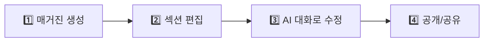

# 📚 프론트엔드를 위한 매거진 API 가이드

> AI가 자동으로 매거진을 생성하고, 사용자가 편집할 수 있는 Mine 서비스의 핵심 API입니다.

---

## 🎯 전체 흐름 한눈에 보기



| 단계 | 설명 | 주요 API |
|------|------|----------|
| 1️⃣ 생성 | 주제만 입력하면 AI가 매거진 자동 생성 | `POST /api/magazines` |
| 2️⃣ 편집 | 각 섹션(카드)을 직접 수정 | `PATCH /api/magazines/{id}/sections/{sectionId}` |
| 3️⃣ AI 대화 | "더 감성적으로 바꿔줘" 같은 명령 | `POST .../interact` |
| 4️⃣ 공유 | 공개 설정 후 링크로 공유 | `PATCH /api/magazines/{id}/visibility` |

---

## 📖 API 상세 가이드

---

## 1️⃣ 매거진 생성 API

### `POST /api/magazines`

주제만 입력하면 AI가 자동으로 매거진을 생성합니다.

#### 📤 Request Body

```json
{
  "topic": "겨울철 따뜻한 패션 트렌드",
  "user_mood": "따뜻하고 아늑한 느낌"
}
```

| 필드 | 타입 | 필수 | 설명 | 프론트엔드 활용 |
|------|------|------|------|----------------|
| `topic` | String | ✅ 필수 | 매거진 주제 | 사용자 입력 텍스트필드에서 받음 |
| `user_mood` | String | ❌ 선택 | 분위기/무드 힌트 | 무드 선택 칩이나 드롭다운으로 제공 가능 |

#### 🎨 프론트엔드 활용법

```javascript
// 생성 버튼 클릭 시
async function createMagazine(topic, mood) {
  const response = await fetch('/api/magazines', {
    method: 'POST',
    headers: {
      'Content-Type': 'application/json',
      'Authorization': `Bearer ${token}`
    },
    body: JSON.stringify({
      topic: topic,           // "겨울 패션"
      user_mood: mood || ''   // "따뜻한 느낌" (선택사항)
    })
  });
  
  // ⚠️ AI 생성은 시간이 걸림! 로딩 표시 필수
  const magazine = await response.json();
  navigateToEditor(magazine.id);
}
```

> 💡 **팁**: 생성에 10~30초 소요될 수 있으니, 로딩 애니메이션과 함께 "AI가 매거진을 만들고 있어요..." 같은 메시지 표시 권장

---

## 2️⃣ 매거진 상세 조회 API

### `GET /api/magazines/{id}`

생성된 매거진의 전체 정보를 조회합니다.

#### 📥 Response Body

```json
{
  "id": 1,
  "title": "겨울철 패션 트렌드",
  "subtitle": "따뜻함과 스타일을 동시에",
  "introduction": "올 겨울 핫한 스타일링 가이드",
  "coverImageUrl": "https://s3.../cover.jpg",
  "tags": "패션,겨울,스타일",
  "moodboardImageUrl": "https://s3.../moodboard.jpg",
  "moodboardDescription": "따뜻한 겨울 분위기",
  "username": "john_doe",
  "isPublic": false,
  "shareToken": "abc123xyz",
  "createdAt": "2024-12-23T10:30:00",
  "sections": [ ... ]
}
```

| 필드 | 타입 | 설명 | 프론트엔드 활용 |
|------|------|------|----------------|
| `id` | Long | 매거진 고유 ID | URL 라우팅, API 호출 시 사용 |
| `title` | String | 매거진 제목 | 상단 헤더에 표시, 수정 가능 |
| `subtitle` | String | 부제목 | 제목 아래 작게 표시 |
| `introduction` | String | 소개글 | 매거진 상단 또는 공유 시 미리보기 |
| `coverImageUrl` | String | 커버 이미지 URL | 목록/상세 대표 이미지로 사용 |
| `tags` | String | 태그 (콤마 구분) | `split(',')` 후 태그 칩으로 표시 |
| `moodboardImageUrl` | String | 무드보드 이미지 | 사이드바나 하단에 무드 이미지로 표시 |
| `moodboardDescription` | String | 무드보드 설명 | 무드보드 이미지 위 자막 |
| `username` | String | 작성자 아이디 | 프로필 링크, 작성자 표시 |
| `isPublic` | Boolean | 공개 여부 | 공개/비공개 토글 UI 상태 |
| `shareToken` | String | 공유용 토큰 | 공유 링크 생성: `/share/${shareToken}` |
| `createdAt` | String | 생성일시 (ISO 8601) | 날짜 포맷팅 후 표시 |
| `sections` | Array | 섹션(카드) 배열 | 아래 섹션 구조 참고 |

#### 🎨 프론트엔드 활용법

```javascript
// 매거진 에디터 페이지 진입 시
async function loadMagazine(id) {
  const res = await fetch(`/api/magazines/${id}`, {
    headers: { 'Authorization': `Bearer ${token}` }
  });
  const magazine = await res.json();
  
  // 헤더 영역
  setTitle(magazine.title);
  setSubtitle(magazine.subtitle);
  setCoverImage(magazine.coverImageUrl);
  
  // 태그 파싱
  const tagList = magazine.tags?.split(',') || [];
  renderTags(tagList);
  
  // 섹션(카드) 렌더링
  renderSections(magazine.sections);
  
  // 공개 상태 토글
  setPublicToggle(magazine.isPublic);
}
```

---

## 🧩 섹션(카드) 구조 이해하기

매거진은 여러 개의 **섹션**으로 구성됩니다. 각 섹션은 UI에서 **하나의 카드**로 표시됩니다.

### 📋 섹션 JSON 구조

```json
{
  "id": 101,
  "heading": "서울의 숨겨진 카페",
  "content": "<p>이곳은 조용히 커피를 즐기기 좋은 공간입니다.</p><p>...</p>",
  "imageUrl": "https://example.com/image.jpg",
  "layoutType": "split_left",
  "layoutHint": "full_width",
  "caption": "카페 내부 전경",
  "displayOrder": 1
}
```

| 필드 | 타입 | 설명 | 프론트엔드 활용 |
|------|------|------|----------------|
| `id` | Long | 섹션 고유 ID | 수정/삭제 API 호출 시 필수 |
| `heading` | String | 섹션 소제목 | 카드 상단에 **굵게** 표시 |
| `content` | String | **HTML 본문** | `dangerouslySetInnerHTML`로 렌더링 (⚠️ XSS 주의) |
| `imageUrl` | String | 대표 이미지 URL | 카드 이미지 영역에 표시 |
| `layoutType` | String | 레이아웃 타입 | 카드 스타일 결정 (아래 표 참고) |
| `layoutHint` | String | 추가 힌트 | `full_width` 등 특수 처리 |
| `caption` | String | 이미지 캡션 | 이미지 아래 작은 텍스트 |
| `displayOrder` | Integer | 표시 순서 | 오름차순 정렬하여 렌더링 |

### 📐 layoutType 별 UI 처리

| layoutType | 설명 | UI 구현 |
|------------|------|---------|
| `hero` | 대형 히어로 섹션 | 전체 너비, 큰 이미지 + 오버레이 텍스트 |
| `basic` | 기본 카드 | 이미지 + 텍스트 세로 배치 |
| `split_left` | 이미지 왼쪽 | 이미지 왼쪽, 텍스트 오른쪽 (50:50) |
| `split_right` | 이미지 오른쪽 | 텍스트 왼쪽, 이미지 오른쪽 (50:50) |
| `quote` | 인용문 스타일 | 큰 따옴표, 중앙 정렬, 이미지 없음 |

#### 🎨 프론트엔드 활용법

```jsx
// React 예시
function SectionCard({ section }) {
  return (
    <div className={`card layout-${section.layoutType}`}>
      <h3>{section.heading}</h3>
      
      {section.imageUrl && (
        <figure>
          
          {section.caption && <figcaption>{section.caption}</figcaption>}
        </figure>
      )}
      
      {/* ⚠️ HTML 본문 렌더링 - XSS 방지 필수! */}
      <div 
        className="content"
        dangerouslySetInnerHTML={{ __html: section.content }} 
      />
    </div>
  );
}

// 전체 섹션 렌더링
function renderSections(sections) {
  // displayOrder 순으로 정렬
  const sorted = [...sections].sort((a, b) => a.displayOrder - b.displayOrder);
  return sorted.map(section => <SectionCard key={section.id} section={section} />);
}
```

---

## ✏️ 섹션 직접 수정 API

### `PATCH /api/magazines/{magazineId}/sections/{sectionId}`

AI 없이 사용자가 직접 섹션 내용을 수정합니다.

#### 📤 Request Body

```json
{
  "heading": "체크 패턴의 매력",
  "content": "<p>요즘 체크무늬가 트렌드입니다.</p>",
  "imageUrl": "https://example.com/new-image.jpg",
  "caption": "체크 패턴 스타일링"
}
```

| 필드 | 타입 | 필수 | 설명 | 프론트엔드 활용 |
|------|------|------|------|----------------|
| `heading` | String | ❌ 선택 | 수정할 소제목 | 인라인 편집 텍스트필드 |
| `content` | String | ❌ 선택 | 수정할 본문 (HTML) | WYSIWYG 에디터 (Quill, TipTap 등) |
| `imageUrl` | String | ❌ 선택 | 수정할 이미지 URL | 이미지 업로드 후 URL 전달 |
| `caption` | String | ❌ 선택 | 수정할 캡션 | 이미지 아래 텍스트필드 |

> 💡 **포인트**: 모든 필드가 선택사항! 바꾸고 싶은 것만 보내면 됩니다.

#### 🎨 프론트엔드 활용법

```javascript
// 에디터에서 "저장" 버튼 클릭 시
async function saveSection(magazineId, sectionId, changes) {
  // changes = { heading: "새 제목", content: "<p>새 본문</p>" }
  // (수정한 필드만 포함)
  
  const response = await fetch(
    `/api/magazines/${magazineId}/sections/${sectionId}`,
    {
      method: 'PATCH',
      headers: {
        'Content-Type': 'application/json',
        'Authorization': `Bearer ${token}`
      },
      body: JSON.stringify(changes)
    }
  );
  
  const updatedSection = await response.json();
  updateSectionUI(updatedSection);
  showToast('저장되었습니다!');
}
```

---

## 🔢 섹션 순서 변경 API

### `PATCH /api/magazines/{magazineId}/sections/reorder`

드래그 앤 드롭으로 카드 순서를 변경합니다.

#### 📤 Request Body

```json
{
  "sectionIds": [103, 101, 102]
}
```

| 필드 | 타입 | 필수 | 설명 | 프론트엔드 활용 |
|------|------|------|------|----------------|
| `sectionIds` | Long[] | ✅ 필수 | 새 순서대로 정렬된 섹션 ID 배열 | 드래그 종료 시 현재 순서 추출 |

#### 🎨 프론트엔드 활용법

```javascript
// react-beautiful-dnd 또는 @dnd-kit 사용 시
function onDragEnd(result) {
  if (!result.destination) return;
  
  // 새 순서로 배열 재정렬
  const newSections = Array.from(sections);
  const [moved] = newSections.splice(result.source.index, 1);
  newSections.splice(result.destination.index, 0, moved);
  
  // UI 즉시 업데이트 (낙관적 업데이트)
  setSections(newSections);
  
  // 서버에 새 순서 전송
  const newOrder = newSections.map(s => s.id);
  await fetch(`/api/magazines/${magazineId}/sections/reorder`, {
    method: 'PATCH',
    headers: {
      'Content-Type': 'application/json',
      'Authorization': `Bearer ${token}`
    },
    body: JSON.stringify({ sectionIds: newOrder })
  });
}
```

---

## 🗑️ 섹션 삭제 API

### `DELETE /api/magazines/{magazineId}/sections/{sectionId}`

> ⚠️ **주의**: 되돌릴 수 없습니다! 확인 모달 필수!

#### 🎨 프론트엔드 활용법

```javascript
async function deleteSection(magazineId, sectionId) {
  // 확인 모달 표시
  if (!confirm('정말 이 섹션을 삭제하시겠습니까?')) return;
  
  await fetch(
    `/api/magazines/${magazineId}/sections/${sectionId}`,
    {
      method: 'DELETE',
      headers: { 'Authorization': `Bearer ${token}` }
    }
  );
  
  // UI에서 섹션 제거
  removeSectionFromUI(sectionId);
  showToast('섹션이 삭제되었습니다');
}
```

---

## 🤖 AI 대화 API

### 레벨 1: 개별 섹션 AI 수정

`POST /api/magazines/{magazineId}/sections/{sectionId}/interact`

특정 섹션의 내용만 AI로 수정합니다.

#### 📤 Request Body

```json
{
  "message": "이 내용을 좀 더 감성적으로 바꿔줘"
}
```

| 필드 | 타입 | 필수 | 설명 | 프론트엔드 활용 |
|------|------|------|------|----------------|
| `message` | String | ✅ 필수 | AI에게 내릴 명령 | 채팅 입력창에서 받음 |

#### 📥 Response Body

```json
{
  "message": "더 감성적인 톤으로 수정했습니다!",
  "actionType": "change_tone",
  "sectionId": 101,
  "section": {
    "id": 101,
    "heading": "서울의 숨겨진 카페",
    "content": "<p>은은한 조명 아래, 커피 향이...</p>",
    "imageUrl": "https://...",
    ...
  }
}
```

| 필드 | 타입 | 설명 | 프론트엔드 활용 |
|------|------|------|----------------|
| `message` | String | AI 응답 메시지 | 채팅 버블로 표시 |
| `actionType` | String | 수행된 액션 타입 | 로그/분석용 |
| `sectionId` | Long | 수정된 섹션 ID | 해당 섹션 업데이트 |
| `section` | Object | 수정된 섹션 전체 데이터 | UI 업데이트에 사용 |

#### 🗣️ 예시 명령어

| 명령어 | AI가 하는 일 |
|--------|-------------|
| "더 길게 늘려줘" | 본문 확장 |
| "짧고 임팩트 있게" | 본문 요약 |
| "전문적인 톤으로" | 톤 변경 |
| "친근하게 바꿔줘" | 톤 변경 |
| "이미지 바꿔줘" | 관련 이미지로 교체 |

#### 🎨 프론트엔드 활용법

```javascript
// AI 채팅 전송
async function sendAiMessage(magazineId, sectionId, userMessage) {
  // 로딩 상태 표시
  setIsLoading(true);
  addChatBubble('user', userMessage);
  
  const response = await fetch(
    `/api/magazines/${magazineId}/sections/${sectionId}/interact`,
    {
      method: 'POST',
      headers: {
        'Content-Type': 'application/json',
        'Authorization': `Bearer ${token}`
      },
      body: JSON.stringify({ message: userMessage })
    }
  );
  
  const data = await response.json();
  
  // AI 응답 표시
  addChatBubble('ai', data.message);
  
  // ⭐ 핵심: 수정된 섹션으로 UI 업데이트
  updateSectionInUI(data.sectionId, data.section);
  
  setIsLoading(false);
}
```

---

### 레벨 2: 매거진 전체 AI 편집

`POST /api/magazines/{magazineId}/interact`

섹션 추가/삭제/전체 분위기 변경 등 **구조적 변경**을 AI에게 요청합니다.

#### 📤 Request Body

```json
{
  "message": "여행 관련 섹션 하나 추가해줘"
}
```

#### 📥 Response Body

```json
{
  "message": "여행 섹션을 추가했습니다!",
  "actionType": "add_section",
  "magazineId": 1,
  "magazine": {
    "id": 1,
    "title": "...",
    "sections": [ ... ]  // 전체 섹션 포함
  }
}
```

| 필드 | 타입 | 설명 | 프론트엔드 활용 |
|------|------|------|----------------|
| `message` | String | AI 응답 메시지 | 채팅 버블로 표시 |
| `actionType` | String | 수행된 액션 | `add_section`, `delete_section`, `change_tone` 등 |
| `magazineId` | Long | 매거진 ID | 확인용 |
| `magazine` | Object | **매거진 전체 데이터** | ⭐ 전체 섹션 목록 다시 렌더링 |

#### 🗣️ 예시 명령어

| 명령어 | actionType | AI가 하는 일 |
|--------|-----------|-------------|
| "섹션 하나 추가해줘" | `add_section` | 새 섹션 생성 |
| "여행 관련 섹션 추가" | `add_section` | 특정 주제 섹션 추가 |
| "두 번째 섹션 삭제해줘" | `delete_section` | 해당 섹션 삭제 |
| "전체적으로 밝은 톤으로" | `change_tone` | 모든 섹션 톤 변경 |
| "결론 부분 추가해줘" | `add_section` | 마지막에 결론 섹션 추가 |

#### 🎨 프론트엔드 활용법

```javascript
// 매거진 레벨 AI 명령
async function sendMagazineAiCommand(magazineId, userMessage) {
  setIsLoading(true);
  
  const response = await fetch(
    `/api/magazines/${magazineId}/interact`,
    {
      method: 'POST',
      headers: {
        'Content-Type': 'application/json',
        'Authorization': `Bearer ${token}`
      },
      body: JSON.stringify({ message: userMessage })
    }
  );
  
  const data = await response.json();
  
  // AI 응답 표시
  addChatBubble('ai', data.message);
  
  // ⭐ 핵심: 매거진 전체를 다시 렌더링
  // (섹션이 추가/삭제되었을 수 있음)
  setMagazine(data.magazine);
  renderSections(data.magazine.sections);
  
  setIsLoading(false);
}
```

---

## 📜 AI 대화 이력 API

### `GET /api/magazines/{magazineId}/interact`

이 매거진에서 AI와 나눴던 대화 목록을 조회합니다.

#### 📥 Response Body

```json
[
  {
    "id": 1,
    "userMessage": "더 감성적으로 바꿔줘",
    "aiResponse": "수정 완료!",
    "actionType": "change_tone",
    "createdAt": "2024-12-23T11:00:00"
  },
  {
    "id": 2,
    "userMessage": "섹션 추가해줘",
    "aiResponse": "새 섹션을 추가했습니다!",
    "actionType": "add_section",
    "createdAt": "2024-12-23T11:05:00"
  }
]
```

| 필드 | 타입 | 설명 | 프론트엔드 활용 |
|------|------|------|----------------|
| `id` | Long | 상호작용 ID | 고유 키 |
| `userMessage` | String | 사용자가 보낸 메시지 | 채팅 히스토리 표시 |
| `aiResponse` | String | AI 응답 | 채팅 히스토리 표시 |
| `actionType` | String | 수행된 액션 | 아이콘/뱃지로 표시 가능 |
| `createdAt` | String | 대화 시간 | 타임스탬프 표시 |

#### 🎨 프론트엔드 활용법

```javascript
// 에디터 진입 시 이전 대화 로드
async function loadChatHistory(magazineId) {
  const response = await fetch(
    `/api/magazines/${magazineId}/interact`,
    { headers: { 'Authorization': `Bearer ${token}` } }
  );
  
  const history = await response.json();
  
  // 채팅창에 이전 대화 표시
  history.forEach(item => {
    addChatBubble('user', item.userMessage, item.createdAt);
    addChatBubble('ai', item.aiResponse, item.createdAt);
  });
}
```

---

## 🔓 공개/공유 API

### `PATCH /api/magazines/{id}/visibility`

매거진 공개/비공개 설정

#### 📤 Request Body

```json
{
  "isPublic": true
}
```

| 필드 | 타입 | 필수 | 설명 |
|------|------|------|------|
| `isPublic` | Boolean | ✅ 필수 | `true`: 공개, `false`: 비공개 |

#### 📥 Response Body

```json
{
  "isPublic": true,
  "shareUrl": "http://localhost:3000/share/abc123xyz"
}
```

| 필드 | 타입 | 설명 | 프론트엔드 활용 |
|------|------|------|----------------|
| `isPublic` | Boolean | 현재 공개 상태 | 토글 UI 상태 업데이트 |
| `shareUrl` | String | 공유 링크 (공개 시만) | 클립보드 복사 버튼 |

### `GET /api/magazines/share/{shareToken}`

**🔓 인증 불필요!** 누구나 공유 링크로 매거진을 볼 수 있습니다.

---

## 📋 전체 API 목록

| Method | Endpoint | 설명 |
|--------|----------|------|
| `GET` | `/api/magazines/me` | 내 매거진 목록 |
| `GET` | `/api/magazines/{id}` | 매거진 상세 |
| `POST` | `/api/magazines` | 매거진 생성 (AI) |
| `DELETE` | `/api/magazines/{id}` | 매거진 삭제 |
| `PATCH` | `/api/magazines/{id}` | 매거진 기본정보 수정 |
| `PATCH` | `/api/magazines/{id}/cover` | 커버 이미지 변경 |
| `PATCH` | `/api/magazines/{id}/visibility` | 공개/비공개 설정 |
| `GET` | `/api/magazines/share/{token}` | 공유 링크 조회 |
| `POST` | `/api/magazines/{id}/like` | 좋아요 토글 |
| `GET` | `/api/magazines/liked` | 좋아요한 목록 |
| `GET` | `/api/magazines/search?keyword=` | 검색 |
| `GET` | `/api/magazines/feed` | 개인화 피드 |
| `GET` | `/api/magazines/{id}/sections/{sectionId}` | 섹션 상세 |
| `PATCH` | `/api/magazines/{id}/sections/{sectionId}` | 섹션 수정 |
| `DELETE` | `/api/magazines/{id}/sections/{sectionId}` | 섹션 삭제 |
| `PATCH` | `/api/magazines/{id}/sections/reorder` | 섹션 순서 변경 |
| `POST` | `/api/magazines/{id}/sections/{sectionId}/interact` | 섹션 AI 수정 |
| `POST` | `/api/magazines/{id}/interact` | 매거진 AI 편집 |
| `GET` | `/api/magazines/{id}/interact` | AI 대화 이력 |
| `POST` | `/api/moodboards` | 무드보드 생성 (AI) |

---

## 🎨 무드보드 (Moodboard) API

무드보드는 사용자의 취향과 관심사를 바탕으로 **AI가 생성하는 배경 이미지**입니다.

### `POST /api/moodboards`

사용자 취향을 분석하여 AI 배경화면을 생성합니다.

#### 📤 Request Body

```json
{
  "topic": "사이버펑크 네온 시티",
  "user_mood": "활기차고 미래적인 느낌",
  "user_interests": ["CYBERPUNK", "GAME", "IT"],
  "magazine_tags": ["네온", "밤거리", "미래"],
  "magazine_titles": ["미래 도시의 밤", "사이버펑크 스타일 가이드"]
}
```

| 필드 | 타입 | 필수 | 설명 | 프론트엔드 활용 |
|------|------|------|------|----------------|
| `topic` | String | ❌ 선택 | 무드보드 주제 | 직접 주제 입력 시 사용 |
| `user_mood` | String | ❌ 선택 | 사용자 기분/분위기 | AI가 톤에 반영 |
| `user_interests` | String[] | ❌ 선택 | 사용자 관심사 코드 목록 | 온보딩에서 수집한 관심사 전달 |
| `magazine_tags` | String[] | ❌ 선택 | 매거진 태그 목록 | 매거진 생성 시 태그 기반 무드보드 |
| `magazine_titles` | String[] | ❌ 선택 | 매거진 제목 목록 | 사용자 콘텐츠 기반 개인화 |

> 💡 **팁**: 필드를 많이 채울수록 AI가 더 개인화된 무드보드를 생성합니다!

#### 📥 Response Body

```json
{
  "image_url": "https://s3.../moodboard-abc123.jpg",
  "description": "활기찬 네온 시티의 밤거리를 담은 무드보드"
}
```

| 필드 | 타입 | 설명 | 프론트엔드 활용 |
|------|------|------|----------------|
| `image_url` | String | 생성된 무드보드 이미지 URL | 배경화면, 프로필 배경 등에 사용 |
| `description` | String | 무드보드 설명 | 이미지 위 자막 또는 alt 텍스트 |

#### 🎨 프론트엔드 활용법

```jsx
import { useState } from 'react';

function MoodboardGenerator() {
  const [moodboard, setMoodboard] = useState(null);
  const [isLoading, setIsLoading] = useState(false);

  async function generateMoodboard() {
    setIsLoading(true);
    
    const response = await fetch('/api/moodboards', {
      method: 'POST',
      headers: {
        'Content-Type': 'application/json',
        'Authorization': `Bearer ${token}`
      },
      body: JSON.stringify({
        topic: '겨울 감성 카페',
        user_mood: '따뜻하고 아늑한',
        user_interests: ['CAFE', 'INTERIOR', 'PHOTOGRAPHY'],
        magazine_tags: ['카페', '겨울', '인테리어']
      })
    });
    
    const data = await response.json();
    setMoodboard(data);
    setIsLoading(false);
  }

  return (
    <div>
      <button onClick={generateMoodboard} disabled={isLoading}>
        {isLoading ? 'AI가 생성 중...' : '무드보드 생성하기'}
      </button>
      
      {moodboard && (
        <div className="moodboard-preview">
          
          <p>{moodboard.description}</p>
        </div>
      )}
    </div>
  );
}
```

#### 🖼️ 무드보드 활용 예시

| 활용처 | 구현 방법 |
|--------|----------|
| **프로필 배경** | `background-image: url(${image_url})` |
| **매거진 커버** | 매거진 생성 시 자동으로 무드보드도 생성됨 |
| **홈 화면 배경** | 사용자 관심사 기반 개인화 배경 |
| **공유 카드** | SNS 공유 시 OG 이미지로 활용 |

#### ⏱️ 생성 시간

> ⚠️ AI 이미지 생성은 **10~30초** 소요됩니다!

```jsx
// 로딩 중 스켈레톤 UI 예시
{isLoading && (
  <div className="skeleton-moodboard">
    <div className="shimmer"></div>
    <p>🎨 AI가 당신만의 무드보드를 만들고 있어요...</p>
  </div>
)}
```

---

## ❓ FAQ

**Q: `content` 필드의 HTML은 어떻게 렌더링하나요?**
> React: `dangerouslySetInnerHTML={{ __html: content }}`  
> Vue: `v-html="content"`  
> ⚠️ XSS 방지를 위해 DOMPurify 같은 라이브러리로 sanitize 권장!

**Q: AI 편집 중 로딩 시간이 길어요**
> AI 생성은 5~20초 소요될 수 있습니다.  
> 스켈레톤 로딩이나 "AI가 수정 중..." 메시지를 표시하세요.

**Q: 이미지는 어디서 오나요?**
> AI가 자동으로 관련 이미지를 생성/검색해서 S3에 업로드합니다.

**Q: 인증 토큰은 어떻게 관리하나요?**
> 로그인 API에서 받은 JWT를 localStorage나 메모리에 저장 후,  
> 모든 요청에 `Authorization: Bearer {token}` 헤더 추가

---

## 🔗 Swagger UI

로컬: `http://localhost:8080/swagger-ui.html`

> 실제 API를 직접 테스트해볼 수 있습니다!
